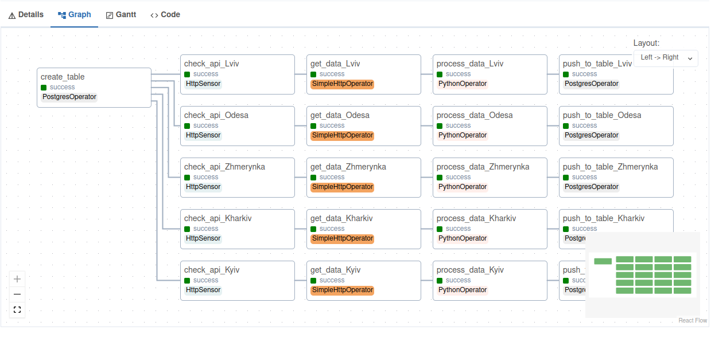

# Airflow Weather Scrapper

### Run

```bash
docker compose up
```

Then, go to the `localhost:8080`, create postgres and http connections
with names `weather_pg_conn` and `weather_http_conn`.

Run `weather_hw1` dag.

